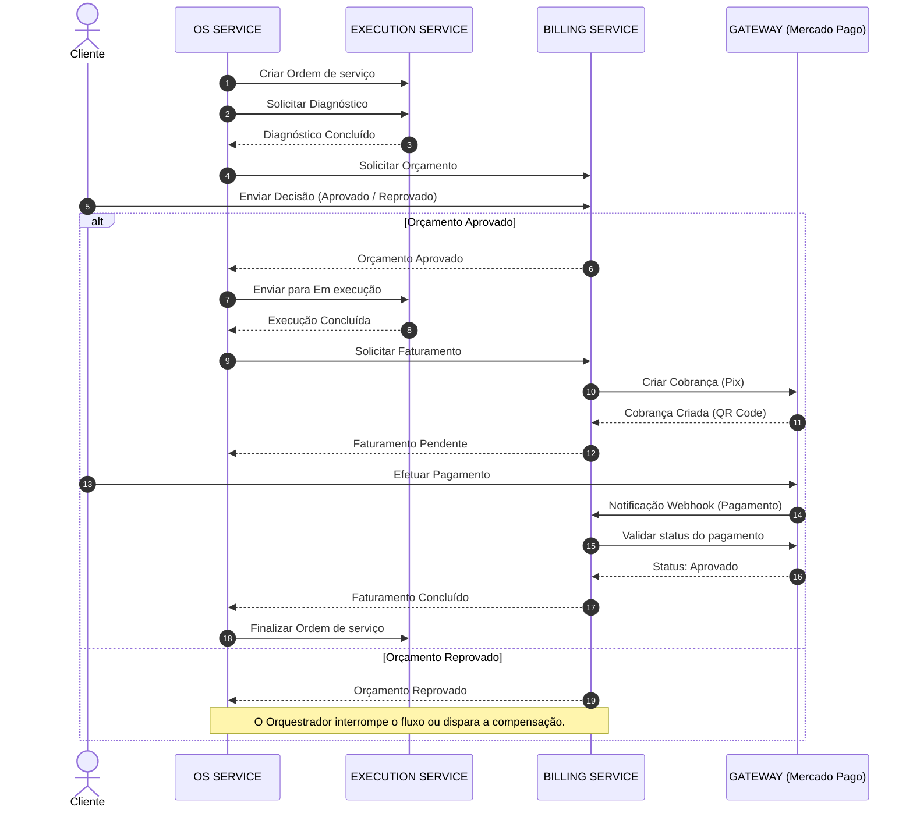

# Oficina48_Billing_Service
Projeto Pós-Tech Fase 04 - Microserviço Billing

Este microsserviço é responsável pelo processamento de faturamentos e pagamentos utilizando o gateway de pagamento Mercado Pago (Sandbox) e mensageria assíncrona com AWS SQS.

---

## 📋 Referência das Filas SQS

O microsserviço utiliza as seguintes filas SQS para a integração de eventos:

| Nome da Fila | Direção | Evento Correspondente | Descrição |
| :--- | :--- | :--- | :--- |
| `faturamento-solicitado` | **Entrada** (Consumer) | `FaturamentoSolicitadoEvent` | Recebe solicitações para iniciar um faturamento (OS Service). |
| `faturamento-pendente` | **Saída** (Producer) | `FaturamentoPendenteEvent` | Notifica que a cobrança foi gerada no Mercado Pago contendo o link/checkout Pix. |
| `faturamento-concluido` | **Saída** (Producer) | `FaturamentoConcluidoEvent` | Notifica que o pagamento foi concluído com sucesso (via Webhook). |
| `faturamento-falhou` | **Saída** (Producer) | `FaturamentoFalhouEvent` | Notifica que a cobrança ou o pagamento falharam/foram rejeitados. |

---

## 🛠️ Guia de Testes do Fluxo de Mensageria Local

Este guia descreve os passos e comandos necessários para testar localmente o ciclo de faturamento e comunicação do microsserviço utilizando o **LocalStack** para simular as filas SQS.

### Pré-requisitos
* Docker e Docker Compose instalados e rodando.
* AWS CLI configurado ou `awslocal` instalado.

---

### 1. Inicializar os Containers
Suba o banco de dados PostgreSQL e o simulador LocalStack:
```bash
docker compose up -d
```

### 2. Simular Solicitação de Faturamento (Fila de Entrada)
Envie o evento de solicitação de faturamento para a fila `faturamento-solicitado` para que o serviço processe e gere a cobrança no Mercado Pago:

```bash
docker exec -it oficina48-localstack awslocal sqs send-message \
  --queue-url http://sqs.us-east-1.localhost.localstack.cloud:4566/000000000000/faturamento-solicitado \
  --message-body '{
    "ordemServicoId": 12345,
    "valor": 150.00,
    "clienteEmail": "cliente@email.com",
    "clienteNome": "Cliente Teste",
    "clienteCpf": "12345678901",
    "descricao": "Cobrança da Ordem de Serviço #12345"
  }'
```

### 3. Obter o Link de Pagamento Gerado (Fila de Resposta)
Consuma a mensagem da fila `faturamento-pendente` para obter o link do Pix e o ID do pagamento gerado:

```bash
docker exec -it oficina48-localstack awslocal sqs receive-message \
  --queue-url http://sqs.us-east-1.localhost.localstack.cloud:4566/000000000000/faturamento-pendente
```
> 💡 **Nota:** O corpo da mensagem conterá o `pagamentoLink` (checkout do Mercado Pago) e o `pagamentoId` (ID da preferência). Copie o `pagamentoId` para usar nos passos abaixo.

---

### 4. Simular Status de Pagamento (Integração Webhook)

> [!IMPORTANT]
> **Como funciona o Webhook do Mercado Pago:**
> Por questões de segurança, o Mercado Pago **não trafega** o status do pagamento (ex: `approved`, `rejected`) diretamente no payload do webhook. O webhook contém apenas o ID do pagamento em `data.id`.
> Ao receber a notificação, o **BILLING SERVICE** realiza uma chamada de retorno (back-channel) à API do Mercado Pago para consultar o status real da transação.
> 
> Para realizar os testes locais:
> * **Cenário de Sucesso:** Realize o pagamento de teste no link Sandbox gerado no passo 3 (usando saldo/cartão de teste de aprovação) e envie o webhook com o ID obtido.
> * **Cenário de Erro:** Realize o pagamento de teste simulando falha (ex: sem saldo ou cartão recusado) e envie o webhook com o ID obtido.

#### 💳 Cartões de Teste e Status (Sandbox)

Utilize os dados abaixo no checkout do Mercado Pago em modo Sandbox para simular os diferentes comportamentos de pagamento:

##### Cartões de Teste

<table style="border-collapse: collapse; width: 100%; border: 1px solid #dcdcdc; text-align: left; margin: 15px 0;">
  <thead>
    <tr style="background-color: #f8f9fa; border-bottom: 2px solid #dcdcdc;">
      <th style="padding: 10px; border: 1px solid #dcdcdc; font-weight: bold;">Cartão</th>
      <th style="padding: 10px; border: 1px solid #dcdcdc; font-weight: bold;">Número</th>
      <th style="padding: 10px; border: 1px solid #dcdcdc; font-weight: bold;">Código de segurança</th>
      <th style="padding: 10px; border: 1px solid #dcdcdc; font-weight: bold;">Data de validade</th>
    </tr>
  </thead>
  <tbody>
    <tr>
      <td style="padding: 10px; border: 1px solid #dcdcdc;">Mastercard</td>
      <td style="padding: 10px; border: 1px solid #dcdcdc;"><code>5031 4332 1540 6351</code></td>
      <td style="padding: 10px; border: 1px solid #dcdcdc;"><code>123</code></td>
      <td style="padding: 10px; border: 1px solid #dcdcdc;"><code>11/30</code></td>
    </tr>
    <tr>
      <td style="padding: 10px; border: 1px solid #dcdcdc;">Visa</td>
      <td style="padding: 10px; border: 1px solid #dcdcdc;"><code>4235 6477 2802 5682</code></td>
      <td style="padding: 10px; border: 1px solid #dcdcdc;"><code>123</code></td>
      <td style="padding: 10px; border: 1px solid #dcdcdc;"><code>11/30</code></td>
    </tr>
    <tr>
      <td style="padding: 10px; border: 1px solid #dcdcdc;">American Express</td>
      <td style="padding: 10px; border: 1px solid #dcdcdc;"><code>3753 651535 56885</code></td>
      <td style="padding: 10px; border: 1px solid #dcdcdc;"><code>1234</code></td>
      <td style="padding: 10px; border: 1px solid #dcdcdc;"><code>11/30</code></td>
    </tr>
    <tr>
      <td style="padding: 10px; border: 1px solid #dcdcdc;">Elo Debito</td>
      <td style="padding: 10px; border: 1px solid #dcdcdc;"><code>5067 7667 8388 8311</code></td>
      <td style="padding: 10px; border: 1px solid #dcdcdc;"><code>123</code></td>
      <td style="padding: 10px; border: 1px solid #dcdcdc;"><code>11/30</code></td>
    </tr>
  </tbody>
</table>

##### Simulação de Status por Nome do Titular (na Sandbox)

Preencha o nome do titular no formulário do cartão usando o status de pagamento abaixo para forçar o comportamento correspondente:

<table style="border-collapse: collapse; width: 100%; border: 1px solid #dcdcdc; text-align: left; margin: 15px 0;">
  <thead>
    <tr style="background-color: #f8f9fa; border-bottom: 2px solid #dcdcdc;">
      <th style="padding: 10px; border: 1px solid #dcdcdc; font-weight: bold;">Status de pagamento</th>
      <th style="padding: 10px; border: 1px solid #dcdcdc; font-weight: bold;">Descrição</th>
      <th style="padding: 10px; border: 1px solid #dcdcdc; font-weight: bold;">Documento de identidade</th>
    </tr>
  </thead>
  <tbody>
    <tr>
      <td style="padding: 10px; border: 1px solid #dcdcdc;"><b>APRO</b></td>
      <td style="padding: 10px; border: 1px solid #dcdcdc;">Pagamento aprovado</td>
      <td style="padding: 10px; border: 1px solid #dcdcdc;">(CPF) <code>12345678909</code></td>
    </tr>
    <tr>
      <td style="padding: 10px; border: 1px solid #dcdcdc;"><b>OTHE</b></td>
      <td style="padding: 10px; border: 1px solid #dcdcdc;">Recusado por erro geral</td>
      <td style="padding: 10px; border: 1px solid #dcdcdc;">(CPF) <code>12345678909</code></td>
    </tr>
    <tr>
      <td style="padding: 10px; border: 1px solid #dcdcdc;"><b>CONT</b></td>
      <td style="padding: 10px; border: 1px solid #dcdcdc;">Pagamento pendente</td>
      <td style="padding: 10px; border: 1px solid #dcdcdc;">-</td>
    </tr>
    <tr>
      <td style="padding: 10px; border: 1px solid #dcdcdc;"><b>CALL</b></td>
      <td style="padding: 10px; border: 1px solid #dcdcdc;">Recusado com validação para autorizar</td>
      <td style="padding: 10px; border: 1px solid #dcdcdc;">-</td>
    </tr>
    <tr>
      <td style="padding: 10px; border: 1px solid #dcdcdc;"><b>FUND</b></td>
      <td style="padding: 10px; border: 1px solid #dcdcdc;">Recusado por quantia insuficiente</td>
      <td style="padding: 10px; border: 1px solid #dcdcdc;">-</td>
    </tr>
    <tr>
      <td style="padding: 10px; border: 1px solid #dcdcdc;"><b>SECU</b></td>
      <td style="padding: 10px; border: 1px solid #dcdcdc;">Recusado por código de segurança inválido</td>
      <td style="padding: 10px; border: 1px solid #dcdcdc;">-</td>
    </tr>
    <tr>
      <td style="padding: 10px; border: 1px solid #dcdcdc;"><b>EXPI</b></td>
      <td style="padding: 10px; border: 1px solid #dcdcdc;">Recusado por problema com a data de vencimento</td>
      <td style="padding: 10px; border: 1px solid #dcdcdc;">-</td>
    </tr>
    <tr>
      <td style="padding: 10px; border: 1px solid #dcdcdc;"><b>FORM</b></td>
      <td style="padding: 10px; border: 1px solid #dcdcdc;">Recusado por erro no formulário</td>
      <td style="padding: 10px; border: 1px solid #dcdcdc;">-</td>
    </tr>
  </tbody>
</table>

---

#### Cenário A: Pagamento Aprovado (Sucesso)
1. Efetue o pagamento acessando o link do Mercado Pago em modo Sandbox com cartões de teste de sucesso.
2. Dispare a notificação do webhook do Mercado Pago simulando a **aprovação** do pagamento (utilizando o ID do pagamento aprovado):

```bash
curl -X POST http://localhost:8082/mercadopago/webhook \
  -H "Content-Type: application/json" \
  -d '{
    "action": "payment.created",
    "api_version": "v1",
    "data": {
      "id": "<PAGAMENTO_ID_APROVADO_NO_SANDBOX>"
    },
    "date_created": "2026-06-27T18:15:00Z",
    "id": 987654321,
    "live_mode": true,
    "type": "payment",
    "user_id": "12345678"
  }'
```

3. Verifique o disparo do evento na fila `faturamento-concluido`:

```bash
docker exec -it oficina48-localstack awslocal sqs receive-message \
  --queue-url http://sqs.us-east-1.localhost.localstack.cloud:4566/000000000000/faturamento-concluido
```

#### Cenário B: Pagamento Recusado (Falha)
1. Efetue o pagamento no link gerado usando cartões de teste de erro do Mercado Pago (ex: sem saldo).
2. Chame o webhook simulando a **recusa** do pagamento (utilizando o ID do pagamento recusado):

```bash
curl -X POST http://localhost:8082/mercadopago/webhook \
  -H "Content-Type: application/json" \
  -d '{
    "action": "payment.created",
    "api_version": "v1",
    "data": {
      "id": "<PAGAMENTO_ID_RECUSADO_NO_SANDBOX>"
    },
    "date_created": "2026-06-27T18:15:00Z",
    "id": 987654321,
    "live_mode": true,
    "type": "payment",
    "user_id": "12345678"
  }'
```

3. Verifique o disparo do evento na fila `faturamento-falhou`:

```bash
docker exec -it oficina48-localstack awslocal sqs receive-message \
  --queue-url http://sqs.us-east-1.localhost.localstack.cloud:4566/000000000000/faturamento-falhou
```

---

### 🧹 Limpeza de Filas (Purge)
Para limpar as mensagens e reiniciar os cenários de testes locais sem interferência, execute:

```bash
# Limpar solicitações
docker exec -it oficina48-localstack awslocal sqs purge-queue --queue-url http://sqs.us-east-1.localhost.localstack.cloud:4566/000000000000/faturamento-solicitado

# Limpar pendentes
docker exec -it oficina48-localstack awslocal sqs purge-queue --queue-url http://sqs.us-east-1.localhost.localstack.cloud:4566/000000000000/faturamento-pendente

# Limpar concluídos
docker exec -it oficina48-localstack awslocal sqs purge-queue --queue-url http://sqs.us-east-1.localhost.localstack.cloud:4566/000000000000/faturamento-concluido

# Limpar falhas
docker exec -it oficina48-localstack awslocal sqs purge-queue --queue-url http://sqs.us-east-1.localhost.localstack.cloud:4566/000000000000/faturamento-falhou
```

---

## 🧪 Testes e Qualidade de Código

### 1. Execução dos Testes Automatizados e BDD (Cucumber)
Para executar a suíte completa de testes unitários, de integração e os cenários BDD com Cucumber:
```bash
mvn clean test
```

### 2. Relatório de Cobertura de Código (JaCoCo)
A aplicação possui um **Quality Gate configurado com limite mínimo de 80% de cobertura de linhas**. Para validar a regra de qualidade e gerar o relatório:
```bash
mvn clean verify
```
O relatório visual em HTML estará disponível localmente em:
`target/site/jacoco/index.html`

### 3. Análise de Qualidade e Segurança (SonarQube / SonarCloud)
O projeto conta com suporte à análise estática de código (Bugs, Code Smells, Vulnerabilidades e Security Hotspots).

Para disparar a análise estática localmente via Maven:
```bash
mvn sonar:sonar \
  -Dsonar.projectKey=oficina48_Billing_Service \
  -Dsonar.projectName=Oficina48_Billing_Service \
  -Dsonar.host.url=https://sonarcloud.io \
  -Dsonar.token=<SEU_SONAR_TOKEN>
```
> 💡 **CI/CD:** Na esteira de CI/CD (GitHub Actions), a verificação do SonarQube é acionada automaticamente durante a execução do workflow `deploy.yml`.

---

## 🔄 Fluxos de Negócio e Integração

O sistema se comunica e gerencia o faturamento através de 4 fluxos principais:

### 1. Geração e Registro do Orçamento Solicitado
* **Nome de Referência:** *Fluxo de Recebimento e Registro de Proposta de Orçamento*
* **Descrição:** Inicialização e o registro de uma proposta de orçamento emitida pelo serviço de ordens de serviço (`OS SERVICE`) para processamento no microsserviço de cobrança (`BILLING SERVICE`).
* **Sequência de Passos:**
  1. O `OS SERVICE` gera um orçamento e publica o evento de **Solicitar Orçamento** (mensagem `enviar-orcamento-solicitado`) na **FILA SQS**.
  2. O `BILLING SERVICE` consome essa mensagem da fila de forma assíncrona.
  3. O `BILLING SERVICE` processa as informações e realiza duas ações concorrentes/sequenciais:
     * Persiste as informações do orçamento no banco de dados (**BD**) para controle interno.
     * Gera um documento em formato de texto (**TXT (ORÇAMENTO)**) contendo os detalhes legíveis do orçamento.

---

### 2. Processamento de Decisão do Orçamento (Aprovação/Reprovação)
* **Nome de Referência:** *Fluxo de Atualização de Status e Notificação de Parecer de Orçamento*
* **Descrição:** Ocorre quando uma decisão de aprovação ou reprovação do orçamento é submetida diretamente ao serviço de cobrança, que então notifica o serviço de ordens de serviço.
* **Sequência de Passos:**
  1. Uma requisição externa contendo a decisão (**Requisição Aprovado/Reprovado**) é enviada diretamente ao endpoint do **BILLING SERVICE** (ex: o cliente realiza a aprovação/reprovação).
  2. O **BILLING SERVICE** atualiza o status daquele orçamento no banco de dados.
  3. O **BILLING SERVICE** dispara um evento de retorno para o **OS SERVICE** informando a decisão:
     * **Orçamento Aprovado** (evento `orcamento-aprovado`): se o parecer for favorável.
     * **Orçamento Reprovado** (evento `orcamento-reprovado`): se o parecer for contrário.
  4. O **OS SERVICE** recebe a atualização e altera o estado da Ordem de Serviço correspondente.

---

### 3. Solicitação de Faturamento e Geração de Meio de Pagamento
* **Nome de Referência:** *Fluxo de Solicitação de Faturamento e Emissão de QR Code (Pix)*
* **Descrição:** Trata da solicitação para início do faturamento de uma ordem de serviço aprovada, resultando na criação de uma cobrança externa e geração do código de pagamento.
* **Sequência de Passos:**
  1. O **OS SERVICE** envia o evento de **Solicitar Faturamento** (mensagem `faturamento-solicitado`) indicando que a OS está pronta para cobrança.
  2. O **BILLING SERVICE** consome o evento da fila SQS `faturamento-solicitado`.
  3. O **BILLING SERVICE** integra-se com a API do gateway de pagamento (Mercado Pago Sandbox) para registrar a intenção de cobrança.
  4. O **BILLING SERVICE** gera as credenciais de pagamento (como o Pix copy-and-paste ou dados do QR Code) e salva/disponibiliza essa representação em arquivo de texto (**TXT (QR CODE)**), mudando o status da transação para pendente.
  5. O **BILLING SERVICE** envia o evento de **Faturamento Pendente** (mensagem `faturamento-pendente`) contendo o link de checkout/Pix para que o sistema possa prosseguir com a disponibilização da cobrança.

---

### 4. Confirmação de Pagamento via Webhook (Conclusão)
* **Nome de Referência:** *Fluxo de Notificação de Pagamento e Liquidação de Faturamento*
* **Descrição:** Confirmação do pagamento pelo gateway externo (via webhook) e a notificação de sucesso ao serviço de ordens de serviço para finalização.
* **Sequência de Passos:**
  1. O gateway de pagamento externo envia uma notificação assíncrona (**Notificação via webhook**) informando que o pagamento foi processado.
  2. O **BILLING SERVICE** recebe a notificação no endpoint de webhook.
  3. O **BILLING SERVICE** busca os detalhes da transação junto à API do gateway para validar se o pagamento foi de fato aprovado.
  4. Uma vez aprovado, o **BILLING SERVICE** altera o status da transação no banco de dados para concluído.
  5. O **BILLING SERVICE** publica o evento de **Faturamento Concluído** (mensagem `faturamento-concluido`) na fila correspondente (ou **Faturamento Falhou** via `faturamento-falhou` se o pagamento for rejeitado).
  6. O **OS SERVICE** consome essa mensagem e atualiza o estado final da Ordem de Serviço correspondente.


### Fluxo de Orquestração da Ordem de Serviço (Saga Pattern)

O diagrama abaixo ilustra o ciclo de vida de uma ordem de serviço e a interação entre os microsserviços, utilizando o `OS SERVICE` como o orquestrador central do fluxo, incluindo a participação do cliente e do gateway de pagamento de forma assíncrona.

